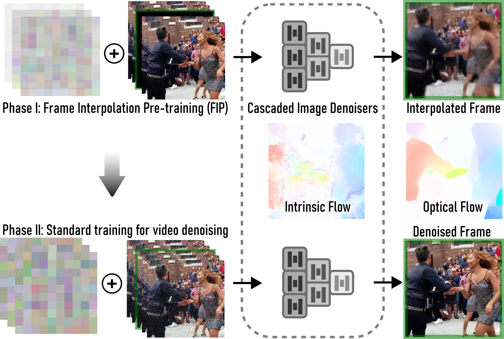

# **Lifting Deep Image Denoisers to Video with Frame Interpolation Pre-training**

<p align="center">
  
</p>

The proposed video denoising adapter trains cascaded image denoisers in two phases. In the first phase, FIP trains the cascade of dense prediction networks (gray) to interpolate the masked central frame (black) using several adjacent input frames with progressively added noise during initial epochs. In the subsequent, standard phase, the same pre-trained cascade is tasked with denoising the central frame, now using unmasked noisy input frames. In the course of this two-phase training, the cascade learns multiple intrinsic flows across input frames without motion-specific modules or external supervision. The flows help leverage the temporal information for improved video denoising. For reference, we illustrate optical flow from [RAFT](https://github.com/princeton-vl/RAFT).

(To use code for models trained on ReCRVD dataset change git branch to "ReCRVD")
### Environment

The code runs on Python 3.8. You can create a virtualenv by running
```
virtualenv -p /usr/bin/python3.8 venv
source venv/bin/activate
pip install -r requirements.txt
pip install --extra-index-url https://developer.download.nvidia.com/compute/redist nvidia-dali-cuda100==1.2.0
```

### Training

If you want to train models first:

1. Login to wandb from your console
2. Train model:

a) with FIP and PostFip epoch:

```
python train_model.py \
	--trainset_dir <path_to_input_mp4s> \
	--valset_dir <path_to_val_sequences> \
	--log_dir <path_to_dir_for_chkecpoints> \
	--wandb_entity <name_of_wandb_entity>
```

b) with FIP and without PostFip epoch:
```
python train_model.py \
	--trainset_dir <path_to_input_mp4s> \
	--valset_dir <path_to_val_sequences> \
	--log_dir <path_to_dir_for_chkecpoints> \
	--wandb_entity <name_of_wandb_entity>
	--no_pfe
```
c) without FIP:
```
python train_model.py \
	--trainset_dir <path_to_input_mp4s> \
	--valset_dir <path_to_val_sequences> \
	--log_dir <path_to_dir_for_chkecpoints> \
	--wandb_entity <name_of_wandb_entity>
	--pe 0
```

### Quantitative evaluation:
```
python eval_quan.py
    --data_dir <path_to_val_sequences> \
    --models <path_to_model1> <path_to_model2> ... <path_to_modelN>
```


### PCIF computation:
```
python PCIF.py
    --data_dir <path_to_val_sequences> \
    --models <path_to_model1> <path_to_model2> ... <path_to_modelN>
```

### Flow map generation:
```
python PCIF.py
    --data_dir <path_to_val_sequences> \
    --output_dir <path_to_dir_for_results> \
    --models <path_to_model1> <path_to_model2> ... <path_to_modelN> \
    --seq_num <number_of_sequence> \
    --frame_num <number_of_frame> \
```

### Data
For evaluation, PCIF computation and flow map generation additional files are needed (test data with added noise, optical flow maps and occlusion masks). In case you would
be interested in, please contact us, we will share prepared files with you.
